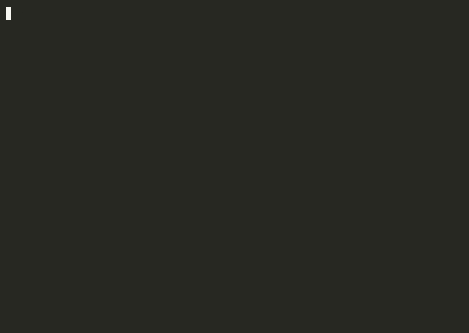

# Larvanex

[](https://github.com/autod3structeur/Larvanex/actions/workflows/ci.yml)
[](LICENSE)
[](https://www.python.org/)
[](https://attack.mitre.org/)
[](CONTRIBUTING.md)

> **Static malware triage with a command-centre terminal UI.** Point Larvanex at a suspicious file and it tells you *whether* it looks malicious, *why*, *what MITRE ATT&CK techniques it maps to*, and *what is hidden inside it* — recursively.

Larvanex was built around one very common attack: an attacker hides a malicious payload inside an innocent-looking file — a PDF, an Office document, an archive or an image. Larvanex doesn't just detect it; it **unpacks the whole nesting**, scans every layer, and can quarantine what it finds.

It never executes what it scans. Everything is static analysis.



```text
╭────────────────────────────────── Larvanex ──────────────────────────────────╮
│ hidden_payload.pdf                                                           │
│ samples/suspicious/hidden_payload.pdf                                        │
│ 106 B   MALICIOUS                                                            │
│ ██████████████░░░░░░░░░░  60/100                                             │
│ SHA-256 c23ebdef91285b5056781a27774467daa87e519e28098dfc1283c407089328cd     │
╰──────────────────────────────────────────────────────────────────────────────╯
┏━━━━━━━━━━┳━━━━━━━━━━━━━━┳━━━━━━━━━━━━━━━━━━━━━━━━━━━┳━━━━━━━━━━━━━━━━━━━━━━━━━━━┓
┃Severity  ┃ Check        ┃ Finding                    ┃ ATT&CK                    ┃
┡━━━━━━━━━━╇━━━━━━━━━━━━━━╇━━━━━━━━━━━━━━━━━━━━━━━━━━━╇━━━━━━━━━━━━━━━━━━━━━━━━━━━┩
│critical  │ embedded     │ Embedded Windows PE        │ T1027.009                 │
│          │              │ executable recovered from  │                           │
│          │              │ a PDF stream               │                           │
└──────────┴──────────────┴───────────────────────────┴───────────────────────────┘
╭───────────────────────────── Embedded artifacts ─────────────────────────────╮
│ hidden_payload.pdf (MALICIOUS)                                               │
│ └── pdf-stream: Windows PE executable @0x0  pdf-stream  264 B                │
╰──────────────────────────────────────────────────────────────────────────────╯
```

---

## Table of contents

- [Highlights](#highlights)
- [Install](#install)
- [Quick start](#quick-start)
- [How it works](#how-it-works)
- [Threat intelligence](#threat-intelligence)
- [YARA rules](#yara-rules)
- [Recursive unpacking & quarantine](#recursive-unpacking--quarantine)
- [Watch mode](#watch-mode)
- [HTML forensic report](#html-forensic-report)
- [ATT&CK Navigator layer](#attack-navigator-layer)
- [Project structure](#project-structure)
- [Extending Larvanex](#extending-larvanex)
- [Development](#development)
- [Roadmap](#roadmap)
- [Disclaimer](#disclaimer)
- [Contributing](#contributing)
- [License](#license)

---

## Highlights

| Capability | What it gives you |
| --- | --- |
| **Command-centre TUI** | Animated scanning, colour-coded verdicts, risk gauges, ATT&CK panels and a sortable summary table. |
| **Recursive unpacking** | Extracts every embedded object (carved files, PDF streams, archive members), scans each one, and shows the nesting as a tree. |
| **Quarantine** | Writes extracted payloads to a folder with their SHA-256, marked `.quarantined` so they can't be run by accident. |
| **Self-contained HTML report** | One portable `.html` file with risk gauges, severity charts, the ATT&CK matrix and a searchable findings table. No CDN, works offline. |
| **MITRE ATT&CK mapping** | Every finding is tagged with real technique IDs, rendered against the ATT&CK tactic matrix, and exportable as an ATT&CK Navigator heatmap layer. |
| **YARA engine** | Bundled rules plus your own `.yar` files, as an extra signature layer. |
| **Threat-intel mesh** | Aggregates MalwareBazaar and VirusTotal (plus a local blocklist) into a single consensus verdict. |
| **Watch mode** | Monitor a folder and scan files the moment they land. |

Detection checks include file-type / magic bytes, extension masquerading, entropy, suspicious strings, PDF structure, embedded files, YARA and hash lookups.

---

## Install

Larvanex needs **Python 3.9+**.

```bash
git clone https://github.com/autod3structeur/Larvanex.git
cd Larvanex

python3 -m venv .venv
source .venv/bin/activate          # Windows: .venv\Scripts\activate

# Recommended: everything (rich TUI, PDF parsing, YARA)
pip install -e ".[pdf,yara]"
```

Extras:

| Extra | Adds |
| --- | --- |
| *(core)* | The CLI, TUI, all analyzers except PDF-deep and YARA. |
| `pdf` | Deeper PDF parsing via `pypdf` (attachments, encryption). |
| `yara` | The YARA rule engine. |
| `dev` | `pytest`, `pypdf`, `yara-python` — for running the tests. |

Prefer not to install anything? `python -m larvanex --help` works from the repo.

---

## Quick start

Generate safe, synthetic sample files:

```bash
python samples/generate_samples.py
```

Scan a file (default command):

```bash
larvanex samples/suspicious/hidden_payload.pdf
```

Recursively unpack and quarantine the embedded payloads:

```bash
larvanex scan --decompose samples/suspicious/dropper.zip
larvanex scan --extract ./quarantine samples/suspicious/hidden_payload.pdf
```

Scan a directory tree and write an HTML report:

```bash
larvanex scan -r samples/suspicious --html report.html
```

Export an ATT&CK Navigator layer:

```bash
larvanex scan -r samples/suspicious --attack-layer layer.json
```

JSON for scripting or CI:

```bash
larvanex scan --json samples/suspicious/hidden_payload.pdf
```

Watch a folder:

```bash
larvanex watch ~/Downloads
```

### Exit codes

| Code | Meaning |
| --- | --- |
| `0` | Likely safe |
| `1` | Suspicious |
| `2` | Malicious, or an error occurred |

---

## How it works

Analyzers run in order over the same immutable `FileContext`, each adding `Finding`s. Findings carry a severity (weighted) and zero or more ATT&CK IDs.

```
file → FileType → Entropy → Strings → PDF → Embedded → YARA → Hash/Intel → score → verdict
```

| Severity | Weight |
| --- | --- |
| critical | 60 |
| high | 30 |
| medium | 15 |
| low | 5 |
| info | 0 |

Weights are summed and capped at 100. Any `critical` finding, or a total ≥ 60, is **MALICIOUS**; ≥ 25 is **SUSPICIOUS**; otherwise **LIKELY SAFE**. Thresholds live in `larvanex/scanner.py`.

When `--decompose` is enabled, the **decomposer** takes over: it extracts every embedded object, scans it with the same analyzer chain, recurses (up to `--depth`, default 3), and builds the artifact tree.

---

## Threat intelligence

The **intel mesh** runs every configured provider and merges the result into one consensus:

| Provider | Needs | Notes |
| --- | --- | --- |
| `blocklist` | `--blocklist file.txt` | Offline. One hash (MD5/SHA-1/SHA-256) per line. |
| `malwarebazaar` | optional `MALWAREBAZAAR_API_KEY` | abuse.ch malware corpus. |
| `virustotal` | `VT_API_KEY` | Multi-engine detections. |

```bash
export VT_API_KEY=xxxxxxxx
export MALWAREBAZAAR_API_KEY=xxxxxxxx
larvanex samples/suspicious/dropper.zip
```

Disable all network lookups with `--no-network`.

---

## YARA rules

List the bundled rules:

```bash
larvanex rules
```

Add your own rule file or directory (repeatable):

```bash
larvanex scan --yara ./my-rules payload.bin
```

Bundled rules live in `larvanex/rules/larvanex.yar` and match markers such as encoded PowerShell, `certutil` download abuse, PDF auto-JavaScript, embedded PE headers and long base64 blobs. They are deliberately small and readable — a starting point, not a complete ruleset.

---

## Recursive unpacking & quarantine

```bash
larvanex scan --extract ./quarantine samples/suspicious/dropper.zip
```

- `--decompose` extracts and rescans embedded objects.
- `--extract DIR` does the same but also writes each payload to `DIR`, named `<sha256[0:16]>_<name>.quarantined`.
- `--depth N` caps recursion (default 3).

Extracted objects come from three sources: carved file signatures (PDFs, images, archives), decompressed PDF streams, and archive members.

---

## Watch mode

```bash
larvanex watch ~/Downloads --interval 1
```

Larvanex snapshots the folder, then scans files as they appear or change, printing a colour-coded alert for each. Stop with `Ctrl+C` for a session summary.

---

## HTML forensic report

```bash
larvanex scan -r samples/suspicious --html report.html
```

The report is a single file with **no external dependencies**: risk gauges, severity bars, the ATT&CK matrix, the embedded-artifact tree and a search box that filters findings live. Perfect for sharing, archiving, or dropping into a GitHub issue.

---

## ATT&CK Navigator layer

```bash
larvanex scan -r samples/suspicious --attack-layer layer.json
```

This writes a [MITRE ATT&CK Navigator](https://mitre-attack.github.io/attack-navigator/) layer. Open the Navigator, upload `layer.json`, and the enterprise matrix is painted as a heatmap: each detected technique is coloured by the highest severity that referenced it and scored by the summed finding weights. Hovering a technique shows which files triggered it.

A ready-to-open example generated from the bundled samples lives at [`examples/attack-layer.json`](examples/attack-layer.json).

---

## Project structure

```text
Larvanex/
├── larvanex/
│   ├── analyzers/
│   │   ├── base.py        # Finding, FileContext, Analyzer base class
│   │   ├── filetype.py    # magic bytes + extension masquerading
│   │   ├── entropy.py     # packed / encrypted payload detection
│   │   ├── strings.py     # suspicious keywords, URLs, base64
│   │   ├── pdf.py         # PDF structure analysis
│   │   ├── embedded.py    # hidden files, macros, zip bombs
│   │   ├── yara.py        # YARA rule engine
│   │   └── hashes.py      # hashes + threat-intel mesh
│   ├── intel/             # MalwareBazaar, VirusTotal, blocklist, mesh
│   ├── rules/larvanex.yar # bundled YARA rules
│   ├── attack.py          # MITRE ATT&CK registry + matrix
│   ├── attack_layer.py    # ATT&CK Navigator layer export
│   ├── decompose.py       # recursive unpacking + quarantine
│   ├── html_report.py     # self-contained HTML report
│   ├── tui.py             # rich command-centre rendering
│   ├── watch.py           # folder monitoring
│   ├── scanner.py         # orchestration, scoring, verdict
│   ├── report.py          # plain-text + JSON output
│   └── cli.py             # command line interface
├── examples/             # demo GIF/cast, TUI screenshot, ATT&CK layer
├── samples/generate_samples.py
├── tests/
└── pyproject.toml
```

---

## Extending Larvanex

Adding a check takes about 20 lines. Return `Finding`s, optionally with ATT&CK IDs:

```python
from .base import Analyzer, Finding, FileContext

class MyAnalyzer(Analyzer):
    name = "my-check"

    def analyze(self, ctx: FileContext) -> list[Finding]:
        if b"definitely_bad" in ctx.data:
            return [Finding(
                category=self.name,
                severity="high",
                message="Found definitely_bad marker",
                attack=["T1204.002"],
            )]
        return []
```

Then register it in `larvanex/scanner.py` → `build_analyzers()`, and add a test.

---

## Development

```bash
pip install -e ".[dev]"

make test     # run the test suite
make lint     # byte-compile every module
make demo     # generate samples and scan the suspicious ones
make help     # list all targets
```

The tests build synthetic files in memory, so they need no network and no real malware. CI runs them on Python 3.9–3.13.

---

## Roadmap

- [ ] Optional local web dashboard
- [ ] OLE/VBA macro extraction and deobfuscation
- [ ] Archive password cracking for blocked ZIPs
- [ ] Emit an ATT&CK Navigator layer from the report
- [ ] VirusTotal sandbox / behavioural reports

---

## Disclaimer

Larvanex performs **static** analysis only and relies on heuristic rules. A "LIKELY SAFE" result does **not** guarantee a file is harmless, and a "SUSPICIOUS" result is not proof of malware. Always combine it with antivirus, sandboxing, and common sense.

---

## Contributing

Contributions are welcome! Please read [CONTRIBUTING.md](CONTRIBUTING.md) and the [Security Policy](SECURITY.md) first. For security-sensitive reports, follow [SECURITY.md](SECURITY.md) rather than opening a public issue.

## License

[MIT](LICENSE)
